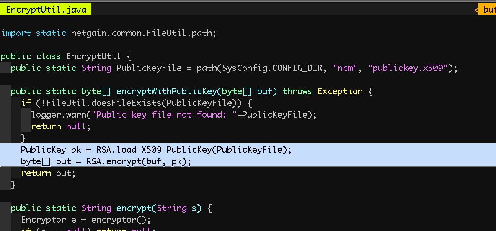

# Screenshots explainer for ISO 27001 compliance

Date: 2025-10-17

This draft organizes the screenshots from `screenshots.doc.docx` and provides brief
explanations to support ISO/IEC 27001 evidence. Each section states the control
intent, what the diagram shows, and a short reviewer checklist.

## Tech 04 – configuration management

- Purpose: Demonstrate secure configuration of platform services and protocols.
- Control intent: Evidence that default/legacy protocols are disabled and secure
  options are enforced (e.g., modern TLS; strong authentication flows).

### Diagram 1: Azure admin console protocol/security settings

What it shows:
- Admin console area where protocol/security defaults are managed.
- Secure protocol settings enabled; legacy/weak protocols disabled.
- Centralized, policy-based configuration (applies consistently across tenants).

Reviewer checklist:
- Confirm weak/legacy protocols are disabled (e.g., SSLv3, TLS 1.0/1.1, basic/legacy auth).
- Confirm only secure protocols are allowed (e.g., TLS 1.2+).
- Capture the current date/time and scope (tenant/subscription) in the screenshot notes.

### Diagram 2: Additional protocol or endpoint configuration

What it shows:
- Complementary view detailing specific services/endpoints inheriting secure configs.
- Enforcement of standards via policy or configuration baseline.

Reviewer checklist:
- Identify the policy/baseline name and its assignment scope.
- Verify non-compliant settings are reported/remediated.

### Diagram 3: Policy/baseline compliance view

What it shows:
- Compliance state for configuration items related to protocol/security settings.

Reviewer checklist:
- Confirm zero critical/high misconfigurations for protocol/security controls.
- Ensure exceptions (if any) are documented with expiry and approvals.

---

## Tech 05 – backup and restoration

- Purpose: Demonstrate backups are successful and restorable.
- Control intent: Evidence of recent successful backups and monitoring for failures.

### Diagram 1: Backup job status and logs

What it shows:
- Overview of backup jobs with latest run status and history.
- Log details indicating no failed jobs in the monitored period.

Reviewer checklist:
- Verify timestamp of the last successful backup within the required RPO.
- Confirm alerting is configured for failed or missed backups.
- Note retention period and storage location classification.

---

## Tech 06 – logging and monitoring

- Purpose: Demonstrate SIEM rules and monitoring coverage.
- Control intent: Evidence that event sources are onboarded and rules/detections are active.

### Diagram 1: SIEM rules/policies overview

What it shows:
- Active analytics/rules with severities and enablement status.
- Coverage across key data sources (e.g., identity, endpoint, cloud resources).

Reviewer checklist:
- Confirm critical detections are enabled and not suppressed.
- Verify rule last modified dates and change approvals (link to change record).
- Ensure data sources show healthy ingestion with recent events.

---

## Tech 10 – SDLC and application security

- Purpose: Demonstrate secure transport and cryptography in use by applications.
- Control intent: Evidence of strong TLS configuration and hashing/crypto mechanisms.

### Diagram 1: TLS protocol and cipher configuration

What it shows:
- Service/application endpoints enforcing TLS 1.2+ and secure cipher suites.

Reviewer checklist:
- Verify deprecated protocols/ciphers are disabled.
- Capture endpoint/environment (prod/stage) and date of validation.

### Diagram 2: Certificate details

What it shows:
- Certificate chain, validity period, key length/algorithm.

Reviewer checklist:
- Confirm valid, non-expired certs from trusted CA; strong key length (e.g., RSA 2048+ or ECDSA).
- Note renewal process and monitoring for expiry.

### Diagram 3: Hashing/crypto mechanism evidence

What it shows:
- Screens or configuration indicating approved hashing algorithms for sensitive data.

Reviewer checklist:
- Verify approved algorithms (e.g., SHA-256/512, Argon2/bcrypt/scrypt for passwords).
- Ensure no use of MD5/SHA-1 for security-sensitive contexts.

---

Notes
- Replace or augment the brief descriptions once screenshots are finalized.
- If sharing externally, review and redact any internal URLs, identifiers, or PII.
- Keep control identifiers (Tech 04/05/06/10) consistent across ISMS references.

